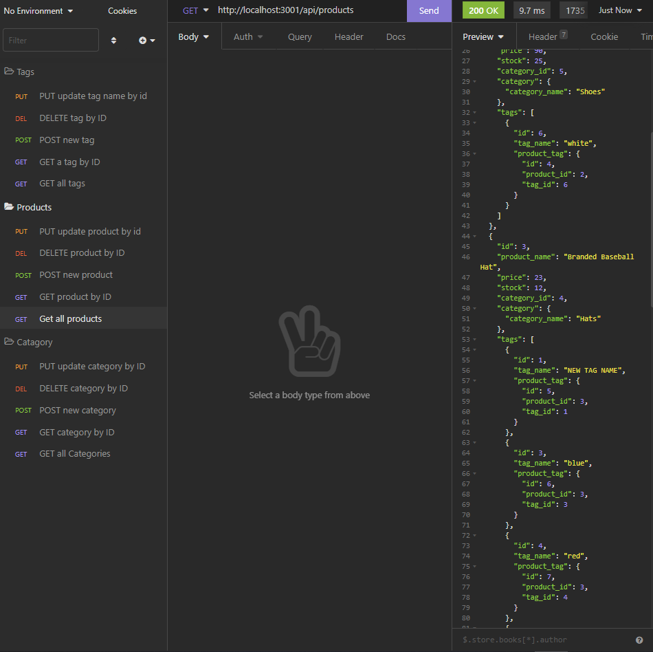

# E-Commerce-Backend

## Description:  
This is a backend API for an online shop. It provides basic functionality of adding, updating, removing item categories, products and tags   


## Installation:
The app requires Node.js and SQL to be installed on the system.  
Once both are installed:  
- run: ```npm i``` from the root folder (only needed initially) 
-  create a file named __*.env*__ in the root of the folder
-  add the following lines to __*.env*__, using your SQL credentials:  
       ```DB_USER=[your user name] ```  
       ```DB_PW= [your password] ``` 
- log into mysql from the root folder and run the following to create the needed database and tables:     
   ```source db/schema.sql;```   
   ```npm run seed (only needed for testing)```   
    [This step is only needed initially]

- run: ```npm start``` from the root directory
## Usage: 
To test this api, an application such as Insomnia is required to test GET, POST, PULL and DELETE requests  

- Get full list by using the following URLs:    
```http://localhost:3001/api/categories```   
```http://localhost:3001/api/products```   
```http://localhost:3001/api/tags```   
- Get individual items by adding /[id] to the end.  

- Post or update new tag by POSTing or PUTing the following JSON to api/tags:   
```{```   
	```"tag_name": "laptop"```   
```}```   
- Post or update a new category by POSTing or PUTing the following JSON to the api/categories:   
```{```  
	```"category_name": "Tools"```  
```}```   

- Post or update a new product by POSTing or PUTing the following JSON to the api/products:   
```  {```  
     ``` "product_name": "Fishing Rod",```  
     ``` "price": 43.00,```  
     ``` "stock": 3,```  
      ```"tagIds": [1,3]```   
    ```}```  
- Delete an item by sending a DELETE request to to api/[item]/[id]  

## [Video Link](https://watch.screencastify.com/v/EJeOkFmNDFCICjvUTJdK)

## Questions
Chris Kurz              [Github](https://github.com/chriskurz098)

If you have any questions, contact Chris Kurz at:

[ckurz098@gmail.com](mailto:ckurz098@gmail.com)


